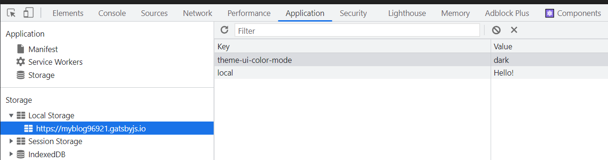
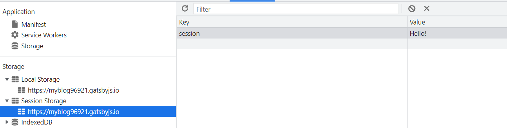
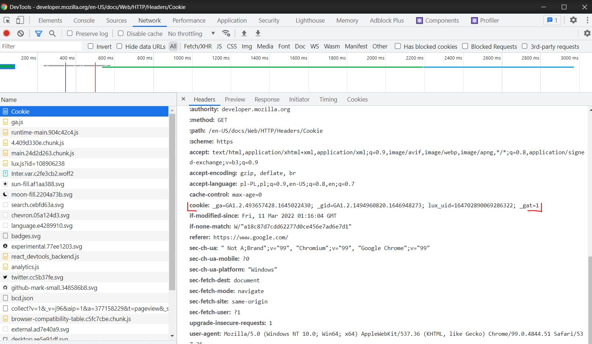

<article>
  <h2>Introduction</h2>
  <p>The browser provides us the two ways to storage a small amount of data on the client side. The first(and older) are cookies, the newer alternative for them is using storage api. What are the differences between them? What are the advantages/disadvantages? When use them? Below I will try to explain it.</p>
</article>
<article>
  <h2>Briefly about cookies</h2>
  <p>
  Cookies keep a small amount of information, they are storage in the browser as a text. By default cookies are attached to every request, so they are sent to server. In practice the cookies are common use to send some data from server to user. We can have access to cookes by referring to <i>document.cookie</i>, and there is a small inconvenience, namely all cookies are kept in one string. The sample <i>document.cookie</i>s content may looks like this:  '_ga=GA1.2.2138379679.1646167857; __gads=ID=d3e3855627e8bcb7-2212357e51cd005c:T=1646167856:RT=1646167856:S=ALNI_Ma9bg0f9jCzkw44ZNJ1clr5zhHOpw; userid=e520c30b6ef0cc36680c953e719996ff; age=25; _gid=GA1.2.1294749342.1646768440'. Working with <i>document.cookie</i> required using the special regex in order to “cut” it into pieces.</p>
</article>

<article>
  <h2>Briefly about storage</h2>
  <p>In the storage we can keep much more information. Also working with storage is much more easier, there is no need to use regex to read the data. The data in storage are available only from our browser, the server does not see them, is not able to overwrite them etc</p>
</article>

<article>
  <h2>The differences</h2>
  <h3>In short</h3>
  <ul>
    <li>Cookies are more elastic when it comes to determining the time of their “service life”</li>
    <li>Cookies are mainly used to send some data from server to browser – the side effect of them is possibility to save data on the browser side from the browser</li>
    <li>Storage api is not attached to any request no way</li>
    <li>Storage api is more capacious than cookies – poor 4KB vs more serious 5MB</li>
    <li>Storage api is more elastic when it comes to the structure of data which we can keep there</li>
  </ul>

  <h3>Cookies vs storage - lifetime</h3>
  <p>It is obvious that we do not want to our data in cookies/storage was kept indefinitely. Both solutions give us options to control how long the data have to be kept. When it comes to storage API, we can use two options, namely localStorage and sessionStorage. The difference between them is easy to understand. The data in localStorage are kept until they are explicitly removed(in the devtools or from the js code using the removeItem() method). The data in sessionStorage are kept only for the time the browser window is “alive”. When user deletes the card the data from sessionStorage ale also deleted. You can run below code in the browser (F12 ->Console ->ctrl+c->ctrl+v), next go to the “Application”, you should see something like this:</p>
  
  
  
  
  <p>Then delete the card and open it again, go to the “Application” one more time and see what has happened – that’s the difference.</p>

```js:title=above-example-code
localStorage.setItem("local", "Hello!");
sessionStorage.setItem("session", "Hello!");
```

<p>When it comes to the cookies by default they behave(when it comes to “life time”) like the sessionStorage. We can control that thanks to two parameters: expires and max-age. The expires sets the cookie expiry date. The max-age is the number of seconds the cookie will be active, so the code:</p>

```js:title=cookie-expires
let nextWeek = new Date(Date.now() + 604800);
nextWeek = nextWeek.toUTCString();
document.cookie = `user=Joe; expires=${nextWeek}`;
```

<p>Will create a sample cookie which will be active one week from the moment of entering the website, while the code like this:</p>

```js:title=cookie-max-age
document.cookie = "user=joe; max-age=604800";
```

  <p>Means that the cookie will be delete after 604800 seconds – that is after a week. The max-age and expieres ensure greater flexibility in the determining the lifetime of our data.</p>

  <h3>The more cookies the bigger requests</h3>
  <p>Cookies by design serve to transfer the small amount of data between the browser and the server. Therefore no one should be surprised that cookies are attached to requests, we can verify it easily using the “Network” tab in the devtools</p>
  
  

  <p>The more cookies, the bigger requests, and thus longer waiting times. When it comes to storage api there is no such a “side effect”.</p>
</article>