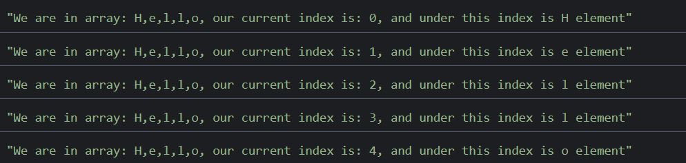

<article>
  <h2>Introduction</h2>
  <p>Loops are one of the most basic thing in each programing language. Despite of <q>classic</q> loops like <strong>for</strong>, <strong>while</strong>, <strong>do...while</strong> there are some characteristic loops for JS like <strong>for...in</strong>, <strong>for...of</strong>, <strong>forEach</strong>, and in this post I am going to explain it for you.</p>
</article>

<article>
  <h2>Classic loops</h2>
  <p><strong>for</strong>, <strong>while</strong>, <strong>do...while</strong> are in mostly programing language, and they were described million times, but as a matter of principle I will describe them as well.</p>

  <p>So <strong>for</strong> loop looks like:</p>

```js:title=example-1
for(iterator_declaration; condition; incrementation/decrementation_of_iterator){
  //body
}
```

<p>And this loop <q>lives</q> until the condition is true, have a look at a simple example:</p>

```js:title=example-2
for(let i = -12; i <= 12; i++){
  console.log(i);
}
```

<p>And our output is: -12 -11 -10 -9 -8 -7 -6 -5 -4 -3 -2 -1 0 1 2 3 4 5 6 7 8 9 10 11 12</p>

<p>But there is some let's say <q>nuisance</q> related with iterator_declaration - do you know? I will tell you at the end of this post.</p>

<p>Okey, let's go to <strong>while</strong>, it looks like: </p>

```js:title=example-3
while(condition){
  //body
}
```
<p>And <strong>while</strong> is performed until the codition is true - the main diffrence between <strong>while</strong> and <strong>for</strong> is that <strong>for</strong> has an iterator by default, of course we can easly rewrite the code from <strong>for</strong> example to <strong>while</strong> implementation:</p>

```js:title=example-4
let i = -12;
while(i <= 12){
  console.log(i);
  i++;
}
```

<p>Result will be the same of course.</p>

<p>And our <q><a href="https://youtu.be/btPJPFnesV4?t=92" target="_blank">last known survivor</a></q> is <strong>do...while</strong>, as the name suggest it has a lot of to do with <strong>while</strong> and that's true, the only diffrence is that <strong>do...while</strong> firstly executes his body, and then checks the condition, se the result of such a code: </p>

```js:title=example-5
do{
  console.log("Hey Jude, don't make it bad.");
}while(false);
```

<p>is: Hey Jude, don't make it bad. When code: </p>

```js:title=example-6
while(false){
  console.log("Hey Jude, don't make it bad.");
}
```
<p>Shows nothing.</p>

</article>

<article>
  <h2>for...in</h2>

  <p>This loop has a lot to do with objects, namely <strong>for...in</strong> goes throught keys of object, so something like this: </p>

```js:title=example-7
const person = {
  name: "Joe",
  age: 19,
  favoriteFood: "pizza",
}

for(const key in person){
  console.log(key);
}
```

<p>returnes: name, age, favoriteFood</p>

</article>

<article>
  <h2>for...of</h2>

  <p>It is like automatick iteration throught iterable object(array, string, DOM collections, and overall all collections with <a href="https://developer.mozilla.org/pl/docs/Web/JavaScript/Guide/Iterators_and_Generators" target="_blank">interator</a>). Look on simple example: </p>

```js:title=example-8
const names = ["Joe", "Mike", "Piter", "Kyle"];

for(const name of names){
  console.log(name);//Joe, Mike, Piter, Kyle
}
```

</article>

<article>
  <h2>forEach</h2>

  <p>This loop is slightly diffrent from the previous ones. forEach is not <q>independent</q> loop, it is the method, which is avaliable for arrays. forEach takes so-called <a href="https://developer.mozilla.org/en-US/docs/Glossary/Callback_function" target="_blank">collback</a>, which takes three arguments, an element, an index, and the entire array (optional). forEach executes the collback for each of the element in ana array, look here:</p>

```js:title=example-9
const numbers = ["H", "e", "l", "l", "o"];
numbers.forEach((el, i, arr)=>{
  console.log(`We are in array: ${arr}, our current index is: ${i}, and under this index is ${el} element`);
});
```

<p>And the result:</p>


</article>

<article>
  <h2>for vs forEach</h2>
  <p>It is not hard to see that <strong>for</strong> and <strong>forEach</strong> have a lot to do with arrays(forEach is an array method, for is the most popular way of iterating throught an array). At the first glance there is no a big diffrence between then, maybe <strong>forEach</strong> is a little bit more easier to read, but (ofcourse) there are some small(or bigger) diffrences between those two types of loops.</p>

  <p>First of all there is a problem with our iterator_declaration when we use var as a keyword in <strong>for</strong>(I know, I know - who uses var nowadays when we have let and const - but in the old project you can still met var, so it is better to know something about this <q>great</q> keyword). Look at those examples:</p>

```js:title=example-10
let i = 13;

for(let i = 1; i < 5; i++){
  console.log(i);
}
console.log(i);

//result 1,2,3,4,13
```

```js:title=example-11
var i = 13;

for(var i = 1; i < 5; i++){
  console.log(i);
}
console.log(i);

//result 1,2,3,4,5
```

<p>Almost the same code, and slightly diffrent result - but why? The <a target="_blank" href="https://developer.mozilla.org/en-US/docs/Web/JavaScript/Reference/Statements/for#syntax">documentation</a> says iterator declaration is:</p>

<blockquote cite="https://developer.mozilla.org/en-US/docs/Web/JavaScript/Reference/Statements/for">
<p>An expression (including assignment expressions) or variable declaration evaluated once before the loop begins. Typically used to initialize a counter variable. This expression may optionally declare new variables with var or let keywords. Variables declared with var are not local to the loop, i.e. they are in the same scope the for loop is in. Variables declared with let are local to the statement.</p>
</blockquote>

<p>Now everything is clear. When we use var we are(in this case) in global scope, and the var inside the loop overwrite the var outside the loop. So why the last value which we see is 5? Let's analyze the lasts steps which happens in this loop(from the step where i = 4): i = 4, 4 &#60; 5(TRUE) so do console.log and i++ ---&#62; i = 5, 5 &#60; 5(FALSE) so do not go inside the loop body, and the i value = 5, so that's why the last value in our example is 5.
</p>

</article>