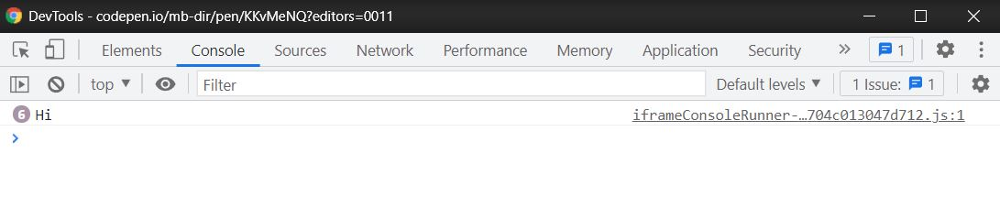
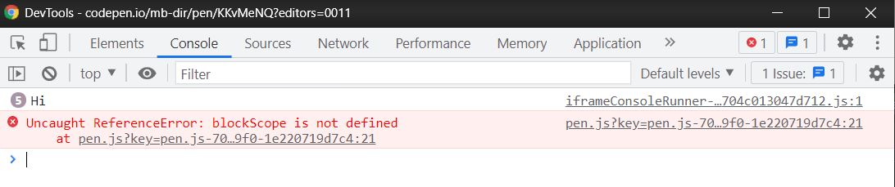
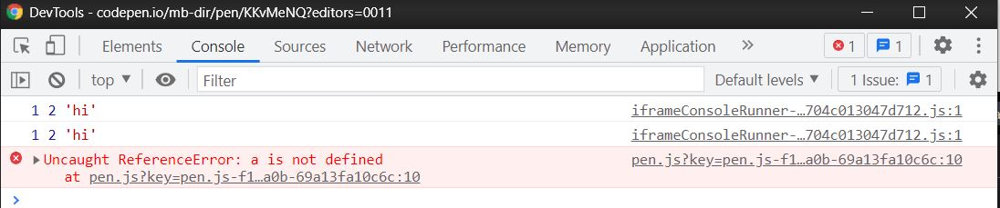

<h2>Introduction</h2>
<p>Today we will speak about really important concept of JavaScript namely about <strong>scope</strong>. We do not use the scope directly, I mean we do not daclare scope like variables or we are not able to read the property of the scope, etc, but we have to know how the scope works. Let's break down the scope!</p>

<h2>The definition</h2>
<p>Scope is just a set of rules according to which JavaScript search the informations included in variable, but what does it mean? That means we are not always to refer to a concrete variable, if JS <q>doesn't see</q> the variable in the concrete scope this information will not be able for us.</p>

<h2>What determines the scope?</h2>
<p>
  When it comes to <q>seeing</q> the variables there are there types of scope(there are also lexical and dynamic scope, but it's a separate topic)
  <ul>
    <li>Global scope</li>
    <li>Block scope</li>
    <li>Function scope</li>
  </ul>
  <strong>Global scope</strong> as the name suggests is global, so the variables daclare in this scope are visible anywhare in the code. We daclare global scope variable and we can use it wherever we want. <strong>Block scope</strong> is limited by &#123; &#125;, so if we daclare the variable in &#123; &#125; we can refer to this variable in this &#123; &#125; and in each <q>child</q> scope(I will show it with examples). <strong>Function scope</strong> is limited by function statement so if we daclare the variable in function we can refer to this variable in this function and in each <q>child</q> scope(the function parameters also belong to function scope). Definitions, definitions... Let's see the examples!

```js:title=global-scope-example
const globalScope = "Hi";

console.log(globalScope);

{
  console.log(globalScope);
}

function test(){
  console.log(globalScope);
  if(true){
    console.log(globalScope);
  }
}

test();

for(let i = 0; i < 7; i++){
  if(i > 3 && i % 2 === 0){
    console.log(globalScope);
  }
}

```

And the result in console:
</p>



<p>
  As you can see we can refer to the <q>globalScope</q> from anywhere, let's see what happen when we come to block scope

```js:title=block-scope-example
{
  const blockScope = "Hi";
  
  console.log(blockScope);
  
  if(true){
    console.log(blockScope);
  }
  
  for(let i = 0; i < 7; i++){
    if(i > 3 && i % 2 === 0){
      console.log(blockScope);
    }
  }
  
  {
    console.log(blockScope);
  }
  
}
console.log(blockScope);

```
Result:
</p>



<p>
  There is an error when it comes to the last console.log(), JavaScript doesn't see the blockScope variable outside the &#123; &#125; cuz the block scope limits it. Of course when it comes to previous refers everything works well, cuz they are <q>child</q> scope. The situatuon is identical when it comes to function scope:

```js:title=function-scope-example
{
function functionScope(a,b){
  const hi = "hi";
  console.log(a, b, hi);
  
  if(true){
    console.log(a, b, hi);
  }
}
functionScope(1, 2);

console.log(a, b, hi);

```
</p>



<p>
  Attempt to refer the variables outside the function scope(or child scope) finishes with the error. Now small task for you, try to predict how this code works:

```js:title=task
{

  {
    const a = 1;
  }
  {
    console.log(a);
  }

}

```

I will answer on this question at the end of the post.
</p>

<h2>The scope advantages</h2>

<p>
Ok, so we know what the scope is, but why is it so useful? First of all thanks to scope there is less chance of naming conflicts.

```js:title=example
function test(){
  const a = 2;
}

function anotherTest(){
  const a = 1;
}

```
VS

```js:title=example
const a = 2;
const a = 1;
```

The another nice thing about the scope is that there is less chance to re-write the variable value, if all variables are declared in global scope chance of accidental variable value overwrittng is getting higher and higher with each new variable.

```js:title=example
function test(){
  let a = 2;
  console.log(a);
}

let a = 1;
console.log(a);//1
test();//2
```
Thanks to the scope, the variables were not overwritten

Also the code readability increses, try to write something easy in JS, but delcare all variables in global scope - 
the bigger the project is, the more unreadable it will be because of global variables.
</p>

<h2>Summary</h2>
<p>The scope is so useful and important JS concept, the scope definition could be incomprehensible, but seeing some practical examples can help to understand this concept. I encourage you to <q>play</q> with scope - for sure that will help you to understand scope.</p>