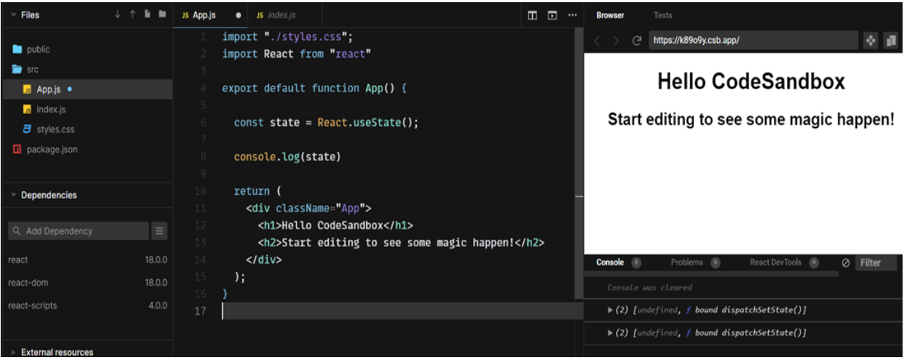
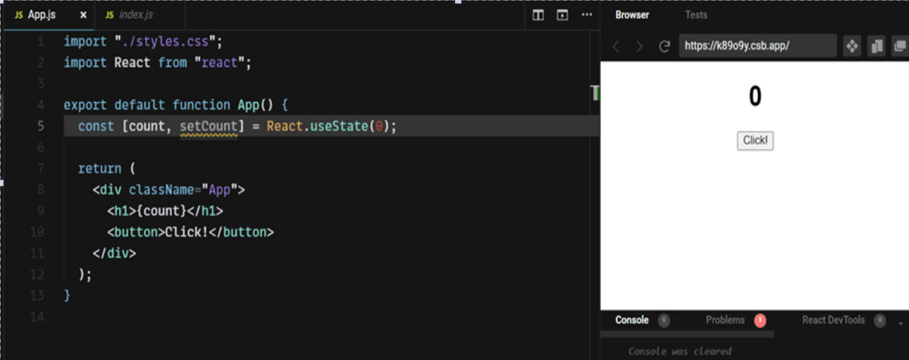
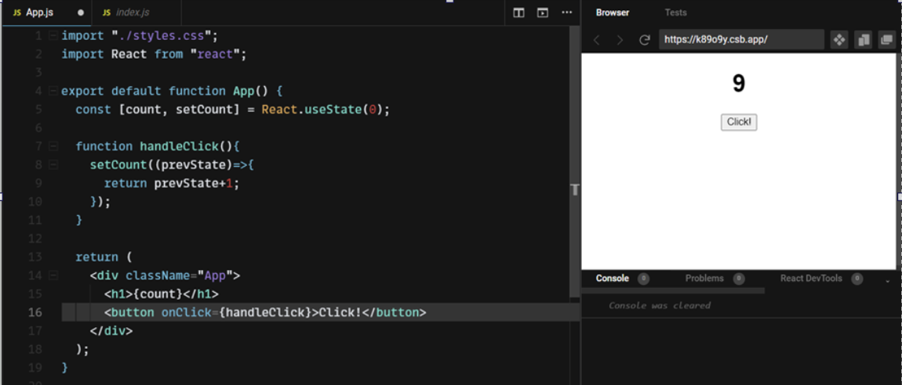
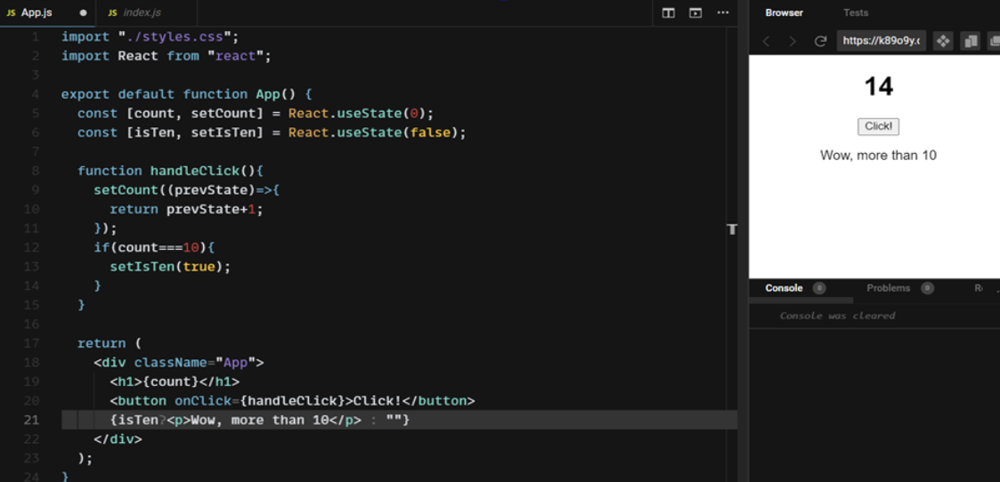

<article>
    <h2>Introduction</h2>
    
React Hooks are really useful, thanks to them we can enjoy the full pool of React benefits without using the class components. Thanks to Hooks we can create everything using function components, which are often more readable and less complicated. Apart from this almost all use the function components – so you will meet them in almost each project – it is good to know them. One of the most basic hook is useState and this post is about him.

</article>
<article>
    <h2>useState theoretically</h2>
    
Generally state is all the data inside the component that we want to be mutable, and we want the change of this portion of data to lead to the re-render of our component. In class components, state was referenced with this.state, all variables that React was supposed to "watch" were kept inside of this object. In function components, state is referenced through useState, thanks to which we can create multiple "pieces" of state.

</article>
<article>
    <h2>useState practically</h2>
    
I will use codesandbox to show practical issues. First, let's see what our useState is:

    
    
As you can see, it is an array of two values - the first one represents the default value of our state, the second one is a function that updates our state. As I mentioned, this is an array, so to make life easier (and more readable) virtually every programmer uses destructuring. Okay, let's create some basic logic based on state. Our program will increase the counter after clicking the button - let's code!

    
    
We have our state with the default value set to 0. After clicking the button, we have to update it somehow - and here the second useState comes in handy:

    
    
We add an onClick listener to our button, which calls handleClick, in this function our state is updated. The update itself is quite simple, setCount has access to the previous state value, we can refer to it and return this value increased by 1 in a collback. there we pass the value "hard" - e.g. we can create another state that will describe whether our count has exceeded 10 (default false), if so, it will be changed to true and something will happen:

    
    
For the full code click <a target="_blank" href="https://codesandbox.io/s/state-example-k89o9y">here</a>

</article>
<article>
    <h2>Summary</h2>
    
The examples in this post were very simple, in your daily life you will have to deal with updating more complex data structures, in this post I consciously included the simplest possible examples so that you can understand the essence of useState.

</article>