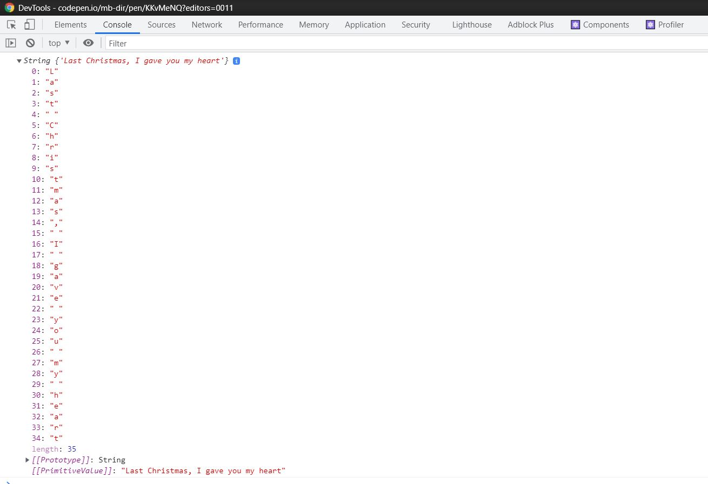
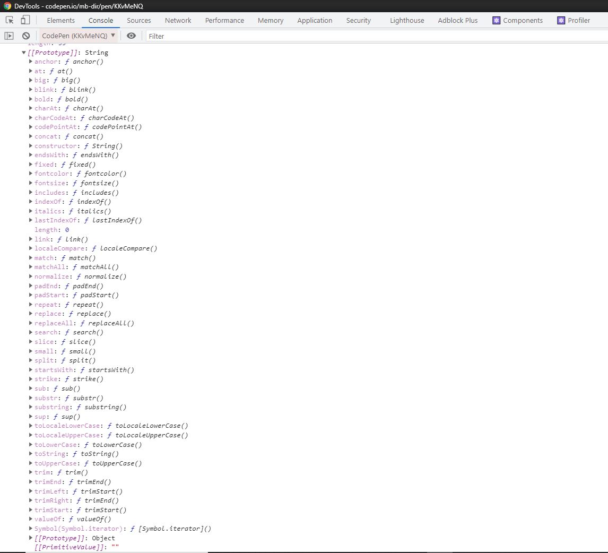

<h2>Introduction</h2>
<p>Have you ever wondered why in JS we can work with primitive type like with reference type? I mean why when we want to upper the string we use <q>toUpperCase()</q> as if it was the method of the object when the string is a primitive type - but why? I will try to explain it to you below.</p>

<h2>The diffrence between string and new String</h2>
<p>In JS we can declarate the string type in two ways:</p>

```js:title=example-1
//1st
const quote1st = "Last Christmas, I gave you my heart";//soon on every radio...

//2nd
const quote2nd = new String("Last Christmas, I gave you my heart");
```

<p>And now we check the type of those two strings</p>

```js:title=example-2
//1st
const quote1st = "Last Christmas, I gave you my heart";//soon on every radio...

//2nd
const quote2nd = new String("Last Christmas, I gave you my heart");

console.log(typeof(quote1st), typeof(quote2nd)); //string object
```

<p>As expected <q>quite2nd</q> is an object, so the object has method so we find the first clue to answer the question, let's go a step further and see what exactly is <q>quote2nd</q></p>

```js:title=example-3
//1st
const quote1st = "Last Christmas, I gave you my heart";//soon on every radio...

//2nd
const quote2nd = new String("Last Christmas, I gave you my heart");

console.log(quote2nd);
```

<p>
  And now in our console we can see:
  
  Let's see the prototype of this object:
  
  Ha! Wee got you! Our <q>toUpperCase()</q> method is here and that means we can use <q>toUpperCase()</q> when it comes to <q>quote2nd</q>, but why when we declarate string like in 1st example we still can use this method since it is not an object(and in theory doesn't have the prototype with <q>toUpperCase()</q>)?
</p>